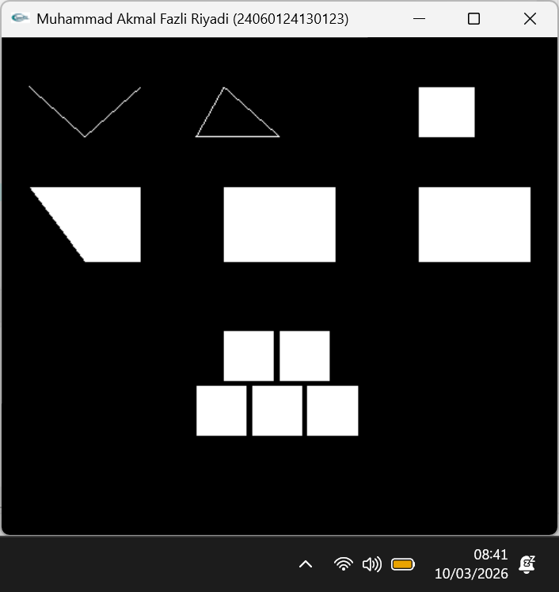

# LAPORAN PRAKTIKUM GTI LAB A2

---

Nama    	: Muhammad Akmal Fazli Riyadi  
NIM     	: 24060124130123  
Kelas   	: A  
Lab    	: A2

---

## Primitive Drawing

#### 1. Titik

#### 2. Garis

#### 3. Segitiga

#### 4. Segiempat

---

## Tugas

Hasil implementasi fungsi GL_LINE_STRIP, GL_LINE_LOOP, GL_TRIANGLE_FAN,GL_TRIANGLE_STRIP, GL_QUADS, dan GL_QUAD_STRIP. Serta hasil dari persegi bertingkat.

Perbedaan membuat titik menggunakan GL_POINT dan garis menggunakan GL_LINES dengan fungsi GL_LINE_STRIP, GL_LINE_LOOP, GL_TRIANGLE_FAN,GL_TRIANGLE_STRIP, GL_QUADS, dan GL_QUAD_STRIP.

* GL_POINTS: Menggambar titik-titik tunggal yang saling terpisah.
* GL_LINES: Menggambar garis lurus yang terputus (setiap 2 titik membentuk 1 garis terpisah).
* GL_LINE_STRIP: Menggambar garis yang terus bersambung dari awal sampai titik akhir (ujungnya tidak menyatu).
* GL_LINE_LOOP: Menggambar garis bersambung, dan titik terakhir otomatis ditarik kembali ke titik awal (membentuk kerangka tertutup).
* GL_TRIANGLE_STRIP: Menggambar deretan bidang segitiga padat yang saling menempel berurutan.
* GL_TRIANGLE_FAN: Menggambar deretan bidang segitiga padat yang menyebar dari satu titik pusat (seperti kipas).
* GL_QUADS: Menggambar bidang segi empat padat yang terpisah (setiap 4 titik membentuk 1 segi empat).
* GL_QUAD_STRIP: Menggambar deretan bidang segi empat padat yang saling menempel berdampingan.
